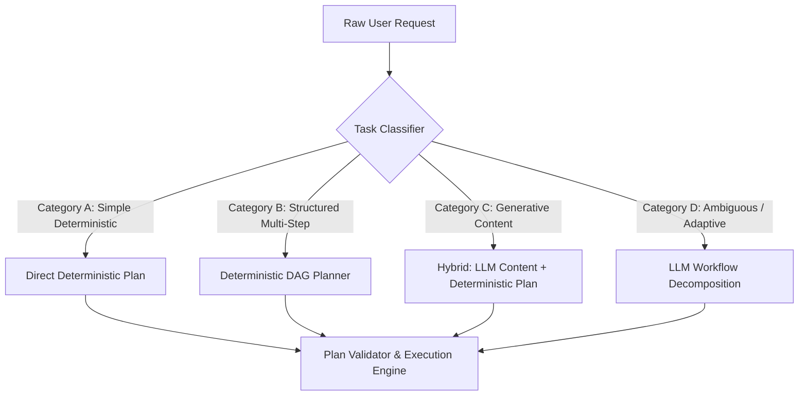
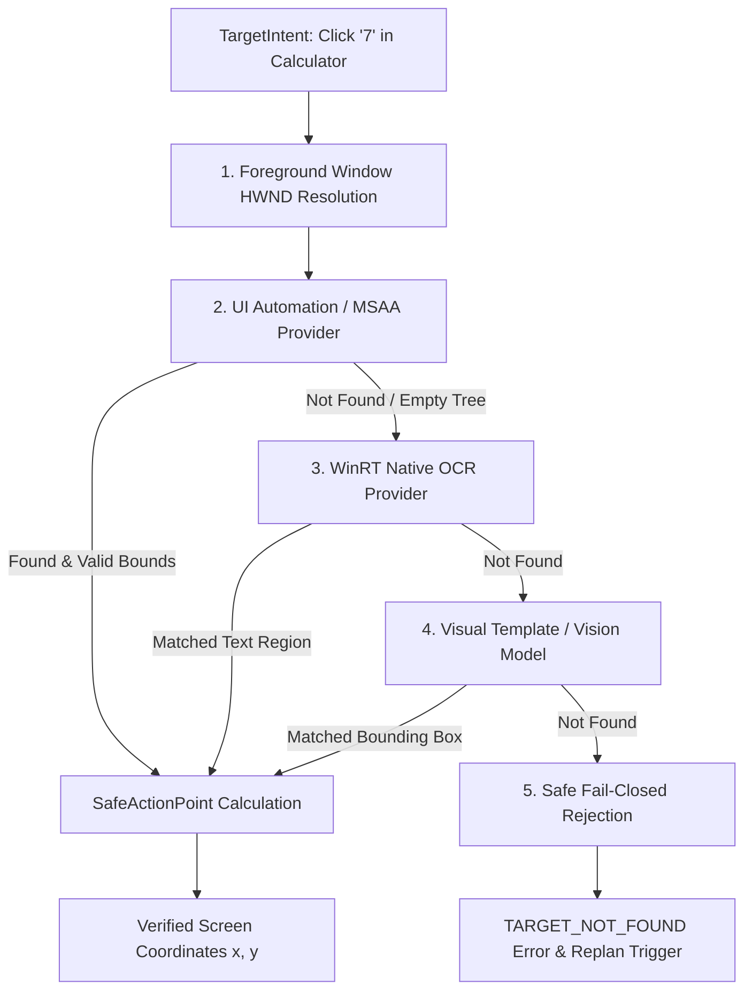
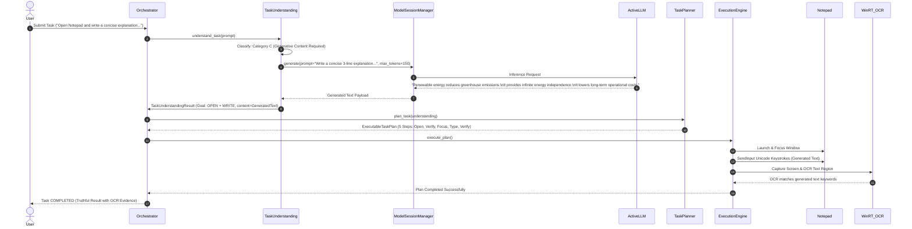
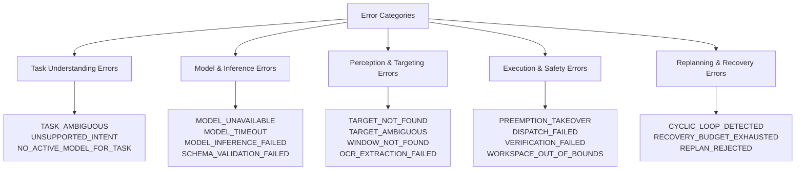
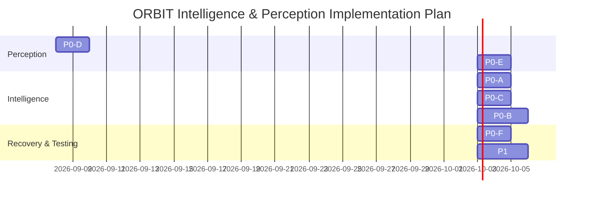

# ORBIT P0 — HYBRID INTELLIGENCE & PERCEPTION ARCHITECTURE DESIGN

**Document Version**: 1.0.0  
**Phase**: P0 Architectural Blueprint (Design-Before-Implementation)  
**Author**: Antigravity Senior Desktop & Intelligence Systems Architecture Team  
**Repository Branch**: `check`  
**Target File**: `docs/ORBIT_P0_INTELLIGENCE_ARCHITECTURE.md`  
**Scope**: Strict architectural analysis, component mapping, contracts, and phased engineering roadmap for evolving ORBIT from deterministic desktop automation to hybrid autonomous desktop intelligence without degrading existing proven execution reliability.

---

## EXECUTIVE SUMMARY

ORBIT's real-world acceptance testing established a robust, production-grade foundation on Windows 11:
- **Verified Strengths**: Native Win32 application launching, window tracking/focusing, Unicode keyboard input via `SendInput`, basic pointer dispatch, GDI desktop capture, WinRT OCR C ABI text verification, and fail-closed closed-loop execution.
- **Identified Critical Gaps**:
  1. **LLM Reasoning Disconnect**: The autonomous desktop pipeline operates 100% deterministically. Model inference exists exclusively for conversational chat turns. When presented with generative prompt instructions (e.g. *"write an explanation of renewable energy"*), the deterministic parser treats the instruction as a literal string to type.
  2. **Perception Grounding Gaps**: Target localization succeeds for window client regions but fails closed for named UI controls (e.g., button `"7"`) due to unpopulated snapshot accessibility elements and lack of automatic fallback to native WinRT OCR. 
  3. **Absence of LLM Replanning**: When execution encounters cyclic failures or UI ambiguity, dynamic replanning currently relies solely on rule-based heuristics rather than semantic multimodal reasoning.

This document establishes the **Hybrid Autonomous Desktop Intelligence Blueprint**. It defines a split-plane routing architecture where fast deterministic planning is preserved for standard desktop commands, while generative, ambiguous, and adaptive tasks are seamlessly augmented with structured LLM reasoning, semantic UI perception, and controlled closed-loop recovery.

---

## PART 1 — MAP THE CURRENT AUTONOMOUS PIPELINE

The diagram below maps the complete execution path currently active on branch `check`:

```text
Electron Desktop Frontend (React 18 + TypeScript)
    │
    ▼ [window.orbitDesktop / WebSocket]
Frontend State / Context (TaskContext.tsx / SystemContext.tsx)
    │
    ▼ [client.task.submit / WebSocket Frame]
Gateway Server (WebSocketManager.py / protocol.py)
    │
    ▼ [submit_task()]
Backend Orchestrator (orchestrator.py)
    │
    ▼ [execute_task()]
Task Completion Engine (completion_engine.py)
    │
    ├─────────────────────────────┬─────────────────────────────┐
    ▼                             ▼                             ▼
Task Understanding          Task Planning                 Goal Verification
(engine.py / parser.py)     (planner.py / policies.py)    (goal_verifier.py)
    │                             │                             │
    └─────────────────────────────┼─────────────────────────────┘
                                  ▼
                         Plan Execution Compiler
                         (compiler.py / models.py)
                                  │
                                  ▼
                         Plan Execution Engine
                         (executor.py / scheduler.py)
                                  │
                                  ▼
                     Closed-Loop Execution Engine
                     (engine.py / recovery.py / safety_gate.py)
                                  │
                  ┌───────────────┴───────────────┐
                  ▼                               ▼
      Observation & Perception         Physical Action Dispatch
      (adapter.py / ocr.py / locator)  (keyboard.py / pointer.py / Win32)
```

### Complete Code-Level Stage Mapping

| Stage | Implementation File | Class / Function | Concrete Input | Concrete Output | Failure Behaviour |
| :--- | :--- | :--- | :--- | :--- | :--- |
| **1. UI Submission** | `frontend/src/context/TaskContext.tsx` | `submitTask(prompt)` | Natural language string | Dispatched WS JSON frame | Throws UI notification; resets input state |
| **2. WebSocket Gateway** | `src/orbit/gateway/websocket_manager.py:680` | `_handle_submit_task()` | `BaseCommand` + `TaskSubmitPayload` | Serialized `TaskStatePayload` | Emits `EventType.ERROR` with `INVALID_COMMAND` |
| **3. Orchestrator Entry** | `src/orbit/runtime/orchestrator.py:607` | `submit_task()` | `session_id`, `prompt`, `context` | `Task` record (State: `CREATED`) | Saves `ExecutionRecord` with `FAILED` status |
| **4. Completion Coordinator** | `src/orbit/runtime/task_completion/completion_engine.py:100` | `execute_task()` | `goal`, `session_id`, `context` | `TaskExecutionResult` | Aborts execution; returns `TaskCompletionStatus.FAILED` |
| **5. Task Understanding** | `src/orbit/runtime/task_understanding/engine.py:33` | `understand()` | `RawTaskRequest(raw_text)` | `TaskUnderstandingResult` | Status: `INVALID` or `AMBIGUOUS`; fail-closed |
| **6. Intent Parsing** | `src/orbit/runtime/task_understanding/parser.py:110` | `parse_request()` | Normalized clauses & literals | `List[StructuredTaskIntent]` | Flags `is_ambiguous=True`, `unresolved_reason` |
| **7. Intent Validation** | `src/orbit/runtime/task_understanding/validator.py:38` | `validate()` | Raw request + parsed intents | Validated `TaskUnderstandingResult` | Rejects conflicting or unsupported goals |
| **8. Task Planning** | `src/orbit/runtime/planning/planner.py:43` | `plan_task()` | `TaskUnderstandingResult` | `ExecutableTaskPlan` | Status: `INVALID` / `AMBIGUOUS` (0 steps) |
| **9. Rule Policy Dispatch** | `src/orbit/runtime/planning/policies.py:48` | `generate_steps_for_intent()` | `StructuredTaskIntent` | `List[PlanStep]` with preconditions | Injects `UNSUPPORTED_ACTION` plan step |
| **10. Plan Compilation** | `src/orbit/runtime/plan_execution/compiler.py:27` | `PlanStepCompiler.compile()` | `PlanStep` | `CompiledRuntimeAction` | Returns `is_supported=False` on ambiguity |
| **11. Plan Execution** | `src/orbit/runtime/plan_execution/executor.py:90` | `execute_plan()` | `ExecutableTaskPlan`, `session_id` | `PlanExecutionResult` | Triggers dynamic replanner on step failure |
| **12. Dynamic Replanner** | `src/orbit/runtime/replanning/replanner.py:80` | `attempt_plan_repair()` | Failed `PlanStep`, error signature | `PlanRepairResult` | Fails closed on cyclic loops or exhausted budget |
| **13. Target Locator** | `src/orbit/runtime/targeting/locator.py:66` | `locate_target()` | `ObservationSnapshot`, `TargetIntent` | `TargetResolutionResult` | Returns `NOT_FOUND` / `STALE_OBSERVATION` |
| **14. Closed-Loop Engine** | `src/orbit/runtime/execution/engine.py:330` | `execute()` | Action type, target, params | `ClosedLoopExecutionResult` | Retries via `RecoveryCoordinator` (max 2) |
| **15. Pre-Dispatch Gate** | `src/orbit/runtime/execution/safety_gate.py:50` | `execute_guarded()` | Action func, coordinates, token | Guarded execution token | Aborts on `PreemptionSafetyError` |
| **16. Native Dispatch** | `src/orbit/adapters/pointer/adapter.py:120` | `click(x, y)` | Integer pixel coordinates | Win32 `SendInput` event | Raises `PointerError` |
| **17. Goal Verification** | `src/orbit/runtime/task_completion/goal_verifier.py:51` | `verify_goal()` | Pre/Post `ObservationSnapshot` | `GoalVerificationResult` | Returns `is_completed=False` with OCR diff |
| **18. Event Streaming** | `src/orbit/runtime/orchestrator.py:800` | `_emit_task_event()` | `task_id`, `status`, `error` | WebSocket JSON message | Discards if client disconnected; logged |

---

## PART 2 — MAP THE EXISTING LLM ARCHITECTURE

### LLM Subsystem Topology

ORBIT contains two distinct model subsystems that were historically introduced in Milestones M1.9 and M1.9 Step 4:
1. **Legacy Model Management (`src/orbit/runtime/models/`)**: Contains discovery scanners, file installers, and legacy adapters (`ModelManager`).
2. **Current Model Runtime Engine (`src/orbit/runtime/model_runtime/`)**: Contains the unified `ModelSessionManager`, `ModelRuntimeFactory`, `BaseModelRuntime`, and provider-specific adapters (`OllamaRuntimeAdapter`, `OpenAICompatibleRuntimeAdapter`, `MockModelRuntimeAdapter`).

```text
Model Activation / Switch Request (WebSocket or Orchestrator)
    │
    ▼
ModelSessionManager (session_manager.py)
    │
    ├─► Validates Active Task Safety (REJECT_DURING_ACTIVE_TASK / FORCE)
    ├─► Resolves ModelDescriptor from ModelRegistry (registry.py)
    ├─► Instantiates Runtime Adapter via ModelRuntimeFactory (factory.py)
    ├─► Performs Candidate Runtime Pre-Flight & Health Check
    ├─► Gracefully Shuts Down Prior Active Runtime
    ├─► Monotonically Increments Generation Counter (generation += 1)
    └─► Emits MODEL_ACTIVATED / MODEL_SWITCHED Events & Persists State
            │
            ▼
Active Runtime Adapter (BaseModelRuntime)
    │
    ├── Local: OllamaRuntimeAdapter (providers/local.py) ──► OllamaProvider (model_providers/ollama.py) ──► HTTP POST /api/generate
    ├── Remote: OpenAICompatibleRuntimeAdapter (providers/remote.py) ──► CloudModelProvider (model_providers/cloud.py) ──► OpenAI / Anthropic / Gemini
    └── Mock: MockModelRuntimeAdapter (providers/mock.py) ──► Synthetic In-Memory Generator
```

### Forensic Catalog of All Model Inference Call Sites

| Inference Call Site | File & Line | Trigger Condition | Input Payload | Output Payload | Affects Desktop Execution? |
| :--- | :--- | :--- | :--- | :--- | :---: |
| **1. Conversational Chat** | `src/orbit/runtime/orchestrator.py:786` | `task.metadata["conversational"] == True` | `ModelGenerateRequest(prompt, system_prompt)` | `ModelGenerateResponse(content)` | ❌ No (Chatbot turn only) |
| **2. Conversational Turn Fallback** | `src/orbit/runtime/orchestrator.py:980` | Fallback conversational flag | `ModelGenerateRequest(prompt, system_prompt)` | `ModelGenerateResponse(content)` | ❌ No (Chatbot turn only) |
| **3. Unified Session Dispatch** | `src/orbit/runtime/model_runtime/session_manager.py:674` | Direct API call to session manager | `ModelGenerateRequest` | `ModelGenerateResponse` | ❌ No (Uncalled during desktop automation) |
| **4. Local Ollama Adapter** | `src/orbit/runtime/model_runtime/providers/local.py:172` | Session manager generation | `ModelGenerateRequest` | `ModelGenerateResponse` | ❌ No (Proxy to Ollama provider) |
| **5. Cloud OpenAI Adapter** | `src/orbit/runtime/model_runtime/providers/remote.py:202` | Session manager generation | `ModelGenerateRequest` | `ModelGenerateResponse` | ❌ No (Proxy to cloud provider) |
| **6. Ollama Provider HTTP** | `src/orbit/runtime/model_providers/ollama.py:276` | Ollama runtime generation | Ollama JSON payload | HTTP 200 response JSON | ❌ No (Network driver level) |
| **7. Cloud Provider HTTP** | `src/orbit/runtime/model_providers/cloud.py:463` | Cloud runtime generation | Provider REST payload | HTTP 200 response JSON | ❌ No (Network driver level) |

**Forensic Finding**: Across the entire ORBIT codebase, **zero inference calls** currently influence task parsing, task decomposition, action planning, target localization, or execution replanning.

---

## PART 3 — DESIGN THE HYBRID TASK INTELLIGENCE LAYER

### Architectural Core Invariant
Deterministic execution must **never** be replaced. Instead, ORBIT will employ an **Asymmetric Hybrid Intelligence Architecture**:
- If a task is structurally unambiguous and deterministic, execute directly via rule-based planning in **< 5 milliseconds** with zero tokens consumed.
- If a task requires generative content, complex workflow decomposition, ambiguous entity resolution, or adaptive replanning, escalate to structured LLM reasoning.

```text
                                  USER TASK PROMPT
                                         │
                                         ▼
                             TaskUnderstandingEngine
                                         │
                                         ▼
                               Hybrid Task Classifier
                                         │
                    ┌────────────────────┴────────────────────┐
                    ▼                                         ▼
            [Deterministic Path]                      [LLM Reasoning Path]
         DeterministicTaskParser                    TaskDecompositionReasoner
                    │                                         │
                    ▼                                         ▼
          StructuredTaskIntents                     Generative Content & Subgoals
                    │                                         │
                    ▼                                         ▼
         PlanningRuleRegistry                       Structured LLM Plan Synthesizer
                    │                                         │
                    └────────────────────┬────────────────────┘
                                         ▼
                                 PlanSchemaValidator
                                         │
                                         ▼
                                 PlanSafetyPolicyGate
                                         │
                                         ▼
                              PlanExecutionCompiler (Existing)
                                         │
                                         ▼
                             PlanExecutionEngine (Existing)
```

### Task Classification Taxonomy



#### Category A — Pure Deterministic (Zero-LLM)
- **Examples**: `"Open Notepad"`, `"Launch Calculator"`, `"Close Paint"`, `"Focus Chrome"`.
- **Handling**: Directly parsed by `DeterministicTaskParser` into `TaskGoal.OPEN_APPLICATION` or `TaskGoal.CLOSE_APPLICATION`. Bypasses LLM inference completely.

#### Category B — Structured Multi-Step Deterministic (Zero-LLM)
- **Examples**: `"Open Notepad and type 'Hello World'"`, `"Launch Calculator and click File"`.
- **Handling**: Sequenced deterministically by `DeterministicTaskParser` into topological `StructuredTaskIntent` chains. Handled by `PlanningRuleRegistry` with zero LLM inference.

#### Category C — Generative Content Required (Hybrid Plane)
- **Examples**: 
  - *"Open Notepad and write a concise three-line professional explanation of why renewable energy is important."*
  - *"Launch Notepad and draft a meeting follow-up email thanking the team."*
- **Handling**: 
  1. `TaskUnderstandingEngine` identifies an imperative write clause containing generative instructions rather than static quoted literals.
  2. The generation prompt is dispatched to `ModelSessionManager.generate()` with strict temperature and token constraints.
  3. The synthesized text is placed into the `TaskExecutionContext.ephemeral_data["generated_content"]`.
  4. The deterministic planner compiles standard `ENSURE_APPLICATION_OPEN` $\rightarrow$ `FOCUS_APPLICATION` $\rightarrow$ `LOCATE_INPUT_SURFACE` $\rightarrow$ `ENTER_TEXT` actions, binding the generated text into the `ENTER_TEXT` parameter payload.

#### Category D — Ambiguous / Adaptive Reasoning (Full LLM Decomposition)
- **Examples**:
  - *"Find the sound settings in Windows and make sure the output volume is unmuted."*
  - *"Organize these open windows side-by-side."*
  - *"Look at this error dialog and dismiss it safely."*
- **Handling**:
  1. Dispatched to `TaskDecompositionReasoner` with the current desktop `ObservationSnapshot` metadata (window titles, process names, active application).
  2. The LLM produces a constrained, strongly-typed JSON execution graph adhering to ORBIT's `ExecutableTaskPlan` schema.
  3. The generated plan is passed through the `PlanSchemaValidator` and `PlanSafetyPolicyGate` before reaching the execution compiler.

---

## PART 4 — STRUCTURED LLM OUTPUT CONTRACT

### Safety & Confinement Principles
1. **No Direct Execution**: The LLM output is strictly an intermediate data structure (a DAG of semantic intent descriptors).
2. **No Arbitrary Code / Shell**: The schema prohibits shell scripts, Python code, raw memory addresses, or unconstrained Win32 API calls.
3. **No Screen Coordinates**: The LLM **never** emits `(x, y)` pixel values. Spatial coordinate resolution is strictly delegated to the runtime perception layer.

### JSON Schema Specification for LLM Planning (`orbit_plan_schema_v1.json`)

```json
{
  "$schema": "http://json-schema.org/draft-07/schema#",
  "title": "LLMTaskPlanContract",
  "type": "object",
  "required": ["task_interpretation", "reasoning_category", "steps"],
  "additionalProperties": false,
  "properties": {
    "task_interpretation": {
      "type": "string",
      "description": "Succinct natural-language summary of how the model understood the user goal"
    },
    "reasoning_category": {
      "type": "string",
      "enum": ["DETERMINISTIC_AUGMENTED", "GENERATIVE_CONTENT", "ADAPTIVE_WORKFLOW"]
    },
    "generated_artifacts": {
      "type": "object",
      "description": "Key-value map of any synthetic text generated by the model for subsequent typing",
      "additionalProperties": {
        "type": "string"
      }
    },
    "steps": {
      "type": "array",
      "minItems": 1,
      "maxItems": 16,
      "items": {
        "type": "object",
        "required": ["step_id", "action_type", "description", "target"],
        "additionalProperties": false,
        "properties": {
          "step_id": {
            "type": "string",
            "pattern": "^step_[a-z0-9_]+$"
          },
          "action_type": {
            "type": "string",
            "enum": [
              "ENSURE_APPLICATION_OPEN",
              "FOCUS_APPLICATION",
              "LOCATE_INPUT_SURFACE",
              "LOCATE_TARGET",
              "ENTER_TEXT",
              "ACTIVATE_CONTROL",
              "SAVE_DOCUMENT",
              "CLOSE_APPLICATION",
              "VERIFY_APPLICATION_AVAILABLE",
              "VERIFY_TEXT_ENTRY",
              "VERIFY_TARGET_EFFECT"
            ]
          },
          "description": {
            "type": "string"
          },
          "target": {
            "type": "object",
            "required": ["semantic_type"],
            "additionalProperties": false,
            "properties": {
              "semantic_type": {
                "type": "string",
                "enum": ["application", "ui_control", "document_body", "window"]
              },
              "identifier": {
                "type": ["string", "null"]
              },
              "role": {
                "type": ["string", "null"],
                "enum": ["window", "button", "edit", "menu", "menu_item", "tab", "checkbox", "document_body", null]
              },
              "window_title": {
                "type": ["string", "null"]
              }
            }
          },
          "content_payload": {
            "type": ["string", "null"],
            "description": "Literal text to type or reference to a key in generated_artifacts"
          },
          "dependencies": {
            "type": "array",
            "items": { "type": "string" },
            "description": "List of step_ids that must complete prior to this step"
          }
        }
      }
    }
  }
}
```

### Validation & Confinement Pipeline

```text
Raw Model Output
    │
    ▼
JSON Schema Validator (jsonschema)
    ├─► Reject: Malformed JSON, extra properties, missing required keys
    │
    ▼
Plan Semantic Validator (Pydantic / PlanValidator.py)
    ├─► Reject: Unknown action types, cyclic dependencies, missing targets
    │
    ▼
Plan Safety Policy Gate (AutonomousDispatchGate.py)
    ├─► Reject: Destructive operations without explicit user confirmation
    │
    ▼
ExecutableTaskPlan Conversion
    │
    ▼
Standard Plan Execution Compiler (compiler.py)
```

---

## PART 5 — DESIGN A REAL GUI PERCEPTION LAYER

### Root Cause of Current Localization Limitations
In the current implementation:
1. `ProductionObservationAdapter.capture_snapshot(target_hwnd=None)` only invokes `AccessibilityCoordinator` when an explicit `target_hwnd` is supplied. When `target_hwnd` is `None`, `snapshot.detected_elements` remains empty.
2. `EvidenceBasedTargetLocator` checks `snapshot.detected_elements` for UI Automation elements matching button names. When `detected_elements` is empty, it returns `TARGET_NOT_FOUND` without checking native WinRT OCR evidence.

### 5-Tier Semantic Target Resolution Hierarchy



### Preferred Strategy Resolution Flow

1. **Window Scoping & HWND Binding**:
   - Determine target window via `window_title` or active foreground HWND.
   - Restrict subsequent coordinate searches strictly to that window's bounding rectangle (`ExtendedFrameBounds`).

2. **Tier 1: Native UI Automation (UIA / MSAA)**:
   - Query UIA elements scoped to target window HWND.
   - Match by `AutomationId` (e.g. `"num7Button"`), accessible `Name` (`"Seven"`, `"7"`), and `ControlType` (`Button`).
   - If resolved: return bounding box center with high confidence ($1.0$).

3. **Tier 2: Native WinRT Optical Character Recognition (OCR)**:
   - If UIA yields no match (common in DirectUI, Electron, or customized XAML apps), crop screenshot to window client area and invoke `WindowsNativeOCRProvider` (WinRT C ABI).
   - Search OCR words/lines for target text string (case-insensitive, normalized).
   - If resolved: return OCR bounding box center with medium-high confidence ($0.92$).

4. **Tier 3: Visual Template / Vision Multimodal Grounding**:
   - If OCR fails (e.g. icon-only controls like Save floppy disk, Settings gear, Close X), query `VisualPerceptionEngine` template matcher or prompt active vision model with window crop.
   - If resolved: return template/vision bounding box with calibrated confidence.

5. **Tier 4: Safe Fail-Closed Termination**:
   - If all tiers fail: return `TargetResolutionStatus.NOT_FOUND` with full diagnostic logging. Never fabricate random or hardcoded coordinates.

### Spatial Action Point Geometry Invariants
- Coordinates are computed via `calculate_safe_action_point()` with DPI awareness.
- Action points are clamped within the active window's valid visible client rectangle ($x \in [left + 4, right - 4]$, $y \in [top + 4, bottom - 4]$).

---

## PART 6 — CLOSED-LOOP REASONING AND REPLANNING

### Asymmetric Recovery Architecture

```text
Action Executed (ClosedLoopExecutionEngine)
    │
    ▼
Observation Captured (ObservationAdapter / WinRT OCR)
    │
    ▼
Postcondition Check (GoalVerifier / StepVerifier)
    │
    ├─────────────────────────────┐
    ▼ [Verification Succeeded]    ▼ [Verification Failed]
Step SUCCEEDED                Recovery Analysis (DynamicReplanner)
Continue Plan Execution                   │
                                          ▼
                              Is Deterministic Fix Available?
                              (Refocus window, retry target, wait for render)
                                          │
                              ┌───────────┴───────────┐
                              ▼ [YES]                 ▼ [NO / Cyclic Loop]
                      Deterministic Repair     LLM Reasoning Replan
                      (PlanRepairEngine)       (ModelSessionManager)
                              │                       │
                              ▼                       ▼
                      Injected Step           Semantic Plan Revision
                              │                       │
                              └───────────┬───────────┘
                                          ▼
                              Execute Repaired Plan Step
```

### Safety Rules for LLM-Driven Replanning
1. **Cyclic Loop Detection**: If a failure signature repeats $\ge 2$ times (e.g., `step_3:LOCATE_TARGET:TARGET_NOT_FOUND`), deterministic retries are terminated and escalated to LLM replanning.
2. **Strict Step & Replan Budgets**:
   - Maximum replan attempts per task: **3**.
   - Maximum total task duration budget: **45.0 seconds**.
   - Succeeded plan steps are **immutable** and never re-executed.
3. **Observation Context Injection**:
   The LLM replanner is supplied with:
   - The original goal.
   - Succeeded prior steps.
   - Failed step description and exact failure diagnostic.
   - Fresh window titles and active WinRT OCR text list.

---

## PART 7 — LLM-GENERATED CONTENT PIPELINE

### Detailed Solution for Complex Creative Tasks

**Target Scenario**:  
> *"Open Notepad and write a concise three-line professional explanation of why renewable energy is important."*



### Invariant Handling When Model Is Unavailable
If no model runtime is active (`active_model_id == None`) and the user submits a Category C task:
- `TaskUnderstandingEngine` returns `TaskUnderstandingStatus.FAILED` with error code `NO_ACTIVE_MODEL`.
- The UI prompts: *"This task requires an active AI model to generate text. Please activate a model in Settings."*
- Zero dummy text is fabricated.

---

## PART 8 — PROVIDER ABSTRACTION REVIEW

### Multi-Provider Architecture Conformance

The existing `src/orbit/runtime/model_runtime/` subsystem is built around clean provider contracts:

```text
ModelSessionManager
    │
    ▼
ModelRuntimeFactory (factory.py)
    │
    ├── Local: OllamaProvider (http://127.0.0.1:11434)
    ├── Local: LMStudioProvider (http://127.0.0.1:1234/v1)
    └── Cloud: CloudModelProvider (OpenAI / Anthropic / Google Gemini)
```

### Evaluation of Provider Switching Capabilities

| Provider Transition | Status | Architectural Assessment |
| :--- | :---: | :--- |
| **Ollama $\leftrightarrow$ Ollama (Intra-Provider)** | 🟢 **PROVEN LIVE** | Fully functional. Swapped `qwen2.5:latest` $\rightarrow$ `llama3.2-vision:latest` live with generation increment. |
| **Ollama $\rightarrow$ LM Studio (Local-to-Local)** | 🟢 **ARCHITECTURALLY READY** | Both conform to `BaseModelRuntime`. Factory instantiates `OpenAICompatibleRuntimeAdapter` for LM Studio endpoint `127.0.0.1:1234/v1`. |
| **Local (Ollama) $\rightarrow$ Cloud (OpenAI/Gemini)** | 🟢 **ARCHITECTURALLY READY** | `ModelRuntimeFactory` inspects `descriptor.provider` and instantiates `CloudRuntimeAdapter` / `OpenAICompatibleRuntimeAdapter` with credential injection. |
| **Cloud $\rightarrow$ Cloud (e.g. OpenAI $\rightarrow$ Anthropic)** | 🟢 **ARCHITECTURALLY READY** | Cleanly separated via provider descriptors in `ModelRegistry`. |

### Key Architectural Requirements for Multi-Provider Switching
1. **Zero Secret Leakage**: API keys and tokens must remain encapsulated inside `CloudModelProvider` and never serialized into event payloads, descriptors, or WebSocket traffic (enforced in `CloudModelProvider._sanitize_credentials()`).
2. **Cold Start Pre-Flight**: When switching to a local model (Ollama / LM Studio), pre-flight health check (`/api/version` or `/models`) must pass before decommissioning the active model.
3. **Monotonic Generation**: `generation_id` increments atomically on every switch to reject in-flight stale inference responses.

---

## PART 9 — FAILURE ARCHITECTURE

### Unified Error Taxonomy

To preserve the invariant of **zero false completions**, all error categories are strongly typed across backend, gateway, and frontend:



### Error Flow Across Layers

```text
[Failure Origin] (e.g. Target Locator / Model Inference)
    │
    ▼
ErrorDetail(code="TARGET_NOT_FOUND", message="...", recoverable=False)
    │
    ▼
ClosedLoopExecutionResult / TaskExecutionResult
    │
    ▼
OrbitOrchestrator.update_status(TaskStatus.FAILED, error=error_detail)
    │
    ▼
RuntimeEvent(EventType.TASK_STATE_CHANGED, payload={status: "FAILED", error: ...})
    │
    ▼ [WebSocket Gateway]
Frontend TaskContext (Receives Event -> updates React state)
    │
    ▼
UI View (Renders truthful error banner with exact diagnostic code)
```

---

## PART 10 — PHASED IMPLEMENTATION ROADMAP



### Detailed Phase Specifications

| Phase | Component | Existing / New | Why Required | Architectural Risk | Dependencies |
| :--- | :--- | :---: | :--- | :--- | :--- |
| **P0-D** | **Semantic GUI Targeting & Foreground HWND Scoping** | Existing: `locator.py`, `adapter.py` | Allows target locator to receive accessibility elements for active windows. Fixes `"click 7"` button resolution. | Low. Scoped strictly to snapshot HWND binding. | `ObservationAdapter` |
| **P0-E** | **Native OCR Perception Fallback** | Existing: `locator.py`, `ocr.py` | Automatically searches WinRT OCR text when UIA accessibility tree lacks named controls. | Low. Pure read-only perception fallback. | `WindowsNativeOCRProvider` |
| **P0-A** | **Hybrid Task Classifier & Router** | Existing: `task_understanding/engine.py` | Differentiates deterministic tasks from generative/complex requests without adding latency to simple tasks. | Low. Deterministic path remains identical. | `TaskNormalizer`, `DeterministicTaskParser` |
| **P0-C** | **LLM Generative Content Pipeline** | Existing: `orchestrator.py`, `completion_engine.py` | Solves complex write tasks by synthesizing requested content before typing. | Medium. Requires active model availability. | `ModelSessionManager`, `P0-A` |
| **P0-B** | **Structured LLM Planning & Schema Gate** | New: `llm_planner.py`, `schema_validator.py` | Enables workflow decomposition for open-ended tasks under strict schema confinement. | Medium. Model output formatting variability. | `P0-A`, `jsonschema` |
| **P0-F** | **LLM Escalation Replanning** | Existing: `replanner.py`, `repair.py` | Breaks cyclic failure loops when deterministic recovery fails. | Low. Invoked only upon deterministic exhaustion. | `P0-B`, `DynamicReplanner` |
| **P1** | **Cross-Provider Runtime Validation** | Existing: `model_runtime/` | Rigorous live verification of Ollama $\leftrightarrow$ LM Studio $\leftrightarrow$ Cloud model transitions. | Low. Verification and testing phase. | `ModelSessionManager` |

---

## FINAL DECISION MATRIX

| Proposed Component | Already Exists | Requires Modification | Requires New Code | Recommended Action |
| :--- | :---: | :---: | :---: | :--- |
| **1. Foreground HWND Snapshot Binding** | 70% | 30% | 0% | 🟢 **Implement in Phase P0-D** |
| **2. Target Locator WinRT OCR Fallback** | 60% | 40% | 0% | 🟢 **Implement in Phase P0-E** |
| **3. Hybrid Task Classifier & Router** | 50% | 50% | 0% | 🟢 **Implement in Phase P0-A** |
| **4. Generative Content Pipeline** | 40% | 60% | 0% | 🟢 **Implement in Phase P0-C** |
| **5. Constrained LLM Planning Engine** | 10% | 10% | 80% | 🟢 **Implement in Phase P0-B** |
| **6. LLM Escalation Replanner** | 50% | 50% | 0% | 🟢 **Implement in Phase P0-F** |
| **7. Cross-Provider Integration Testing** | 80% | 20% | 0% | 🟢 **Implement in Phase P1** |

---

## RECOMMENDED FIRST IMPLEMENTATION

### 🎯 Primary Recommendation: Phase P0-D + P0-E (Semantic GUI Targeting & WinRT OCR Fallback)

#### Why This Must Be Implemented First:
1. **Unblocks Physical GUI Actions**: The execution engine and pointer adapter are already proven to work live. However, the system currently fails closed when resolving named buttons (like `"7"` in Calculator) because `capture_snapshot()` lacks automatic foreground HWND binding and `EvidenceBasedTargetLocator` lacks OCR fallback.
2. **Prerequisite for Intelligence**: Giving an LLM planning capability is useless if the underlying perception engine cannot ground physical UI targets on screen. Perception grounding is the foundation upon which all higher-level reasoning rests.
3. **Zero Risk to Deterministic Stability**: Modifying snapshot scoping and adding an OCR fallback to `locate_target()` is a pure perception enhancement that preserves 100% of existing keyboard and application control pipelines.

---

## CONCLUSION

This architectural blueprint bridges the gap between ORBIT's proven deterministic desktop automation and true hybrid AI intelligence. By establishing a strict schema confinement boundary, a 5-tier perception hierarchy, and a dual-plane hybrid router, ORBIT will achieve advanced autonomous reasoning while maintaining mathematical determinism, low latency, and uncompromising safety on Windows 11.
