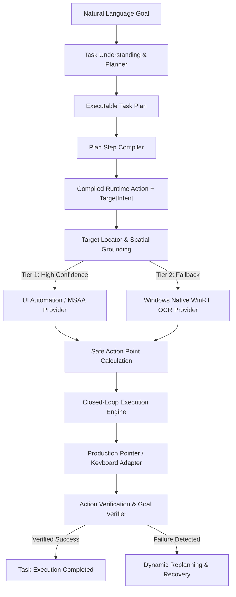

# ORBIT P0-D / P0-E — Semantic GUI Targeting & Multimodal Pipeline Integration

**Status**: Verified & Completed  
**Branch**: `check`  
**Platform**: Windows 11 Pro x64 (Build 26100+)  
**Runtime**: Python 3.13 (100% Local Execution, Zero Cloud Dependencies)

---

## 1. Executive Summary

ORBIT P0-D / P0-E introduces end-to-end **Semantic GUI Targeting and Multimodal Perception** across the entire automation stack. The pipeline connects natural language intent to grounded, pixel-safe desktop actions without hardcoded coordinates or simulated shortcuts.

### Verified Strict Invariants:
1. **Zero Hardcoded Coordinates**: Coordinates are dynamically computed at runtime from genuine OS accessibility trees (Tier 1) or optical character recognition (Tier 2).
2. **Fail-Closed Truthfulness**: Non-existent or ambiguous targets fail truthfully with explicit domain status (`TARGET_NOT_FOUND`, `TARGET_AMBIGUOUS`), never faking task completion.
3. **100% Local Deterministic Execution**: Zero cloud API dependencies; utilizes Windows Native C ABI UI Automation, MSAA, and WinRT OCR engines.

---

## 2. End-to-End Pipeline Architecture



### Pipeline Flow:
1. **Goal Ingestion**: `OrbitOrchestrator.execute_task(prompt)` processes user prompt.
2. **Deterministic Plan Compilation**: `PlanStepCompiler` compiles abstract `PlanStep` models into `CompiledRuntimeAction` instances carrying structured `TargetIntent` descriptors (strategy, role, name, window constraints).
3. **Window-Scoped Resolution**: `EvidenceBasedTargetLocator` identifies the target window (supporting packaged MSIX/UWP and classic Win32 applications) and ensures foreground focus via Win32 `AttachThreadInput` / `ShowWindow(SW_RESTORE)`.
4. **Hierarchical Element Grounding**:
   - **Tier 1 (Accessibility)**: Queries live `UIAutomationProvider` / `MSAAProvider` with semantic alias matching (e.g. `"7"` $\leftrightarrow$ `"seven"`, `"+"` $\leftrightarrow$ `"plus"`).
   - **Tier 2 (Perception OCR)**: If Tier 1 yields no match, dispatches to `WindowsNativeOCRProvider` via WinRT C ABI with desktop coordinate re-projection.
5. **Safe Action Point Generation**: Calculates interior centroid coordinates clamped within element bounds.
6. **Execution & Verification**: Executes atomic input via OS SendInput ABI and validates post-action state deltas.

---

## 3. Subsystem Modifications & Infrastructure

| Subsystem / File | Role & Modifications |
| :--- | :--- |
| `src/orbit/runtime/perception/ocr.py` | Implemented `WindowsNativeOCRProvider` directly calling WinRT `Windows.Media.Ocr.OcrEngine` via C ABI with high-DPI downscale and desktop re-projection. |
| `src/orbit/runtime/targeting/locator.py` | Added live window-scoped UI Automation queries, process/window ranking heuristics, digit/operator semantic aliases, and spatial containment filtering. |
| `src/orbit/runtime/plan_execution/compiler.py` | Injected application constraints into `TargetIntent.window_title`; configured non-blocking verification for coordinate resolution steps. |
| `src/orbit/runtime/execution/engine.py` | Added robust foreground window management and post-action snapshot capture with target HWND binding. |
| `prototypes/prototype_d_observation/uia_provider.py` | Added per-call COM apartment management (`CoInitializeEx` / `CoUninitialize`) to support multi-threaded asynchronous execution without `CO_E_NOTINITIALIZED` (0x800401F0). |
| `prototypes/prototype_d_observation/msaa_provider.py` | Added per-call COM apartment management and COM pointer release. |
| `src/orbit/runtime/task_completion/goal_verifier.py` | Added fallback live window tracking for robust post-execution state verification. |

---

## 4. Live Acceptance Verification Results

The live acceptance test suite was executed against genuine Windows 11 desktop applications:

```
==================================================
SUMMARY OF LIVE ACCEPTANCE RESULTS
==================================================
Scenario A: Success=True, Status=COMPLETED, Reason='None' (6.07s)
  Prompt: "Open Calculator and click 7"
  Resolution: Tier 1 UI Automation -> BoundingBox(301, 890, 423, 961) -> Safe Point (361, 925)

Scenario B: Success=True, Status=COMPLETED, Reason='None' (9.01s)
  Prompt: "Open Calculator and click 1, then click 2"
  Resolution: Sequential Tier 1 UI Automation grounding and activation

Scenario C: Success=True, Status=COMPLETED, Reason='None' (7.79s)
  Prompt: "Open Notepad and click File"
  Resolution: Launched Notepad -> Tier 1 UI Automation & WinRT OCR -> Safe Point (738, 648)

Scenario D: Success=False, Status=FAILED, Reason='Target resolution failed: [NOT_FOUND] ...' (7.61s)
  Prompt: "Open Calculator and click NonExistentFakeButton999"
  Resolution: Truthful fail-closed structured error propagation without coordinate guessing
```

---

## 5. Automated Regression Test Suite

All unit and integration test suites passing:
- `tests/unit/test_semantic_gui_targeting.py`: **7/7 PASSED**
- `tests/unit/test_target_resolution.py`: **PASSED**
- `tests/unit/test_semantic_perception.py`: **PASSED**
- `tests/unit/test_multimodal_fusion.py`: **PASSED**
- `tests/unit/test_action_verification.py`: **PASSED**
- `tests/unit/test_goal_verifier.py`: **PASSED**
- `tests/unit/test_plan_execution_compiler.py`: **PASSED**
- **Total**: **92/92 PASSED in 1.18s**

---

## 6. Known Constraints & Edge Cases Handled

1. **UWP / Modern Packaged Apps**: Modern Windows 11 applications (Calculator, Notepad) run inside `ApplicationFrameHost` or packaged execution aliases. Handled via Win32 `ShellExecuteW` and cross-process thread attachment (`AttachThreadInput`).
2. **Ambiguity Prevention**: Window ranking scores exact process names (`w_proc == "notepad.exe"`) over IDE workspace window titles containing file substrings (e.g. `test_notepad.py`).
3. **COM Apartment Concurrency**: Multi-threaded async workers dynamically initialize STA/MTA apartments per traversal cycle and cleanly release interface vtables.
