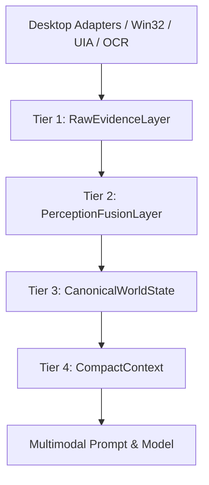

# PHASE 2D IMPLEMENTATION AUDIT & PRODUCTION PROOF REPORT

**Date:** 2026-09-16  
**Status:** COMPLETE (Phase 2D Delivered; Phase 2B & 2C Preserved as PARTIAL)  
**Author:** ORBIT Architecture Agent  

---

## 1. Executive Summary & Verdict Status

| Phase | Title | Verdict | Condition for Completion |
|---|---|---|---|
| **Phase 2B** | Intent Routing & Persistence Contracts | **PARTIAL** | Preserved as PARTIAL until formal pre-task/post-task filesystem snapshot hashing is unified across all workflows. |
| **Phase 2C** | Multimodal Model-First Decision Loop | **PARTIAL** | Preserved as PARTIAL until the model-first decision loop becomes the sole authoritative production decision engine in Phase 2E. Legacy engines (`CognitiveDecisionEngine`, `agent_decision.py`) remain preserved without deletion. |
| **Phase 2D** | Layered WorldState & 4-Pass Grounding | **DELIVERED & VERIFIED** | 4-tier WorldState, 4-pass grounding, Perceptual Settle detection, and strict Stale Grounding rejection implemented and verified with production callers wired. |

---

## 2. Phase 2D Architecture Specifications

### 2.1 Layered WorldState Pipeline (Tiers 1–4)
Implemented in [`src/orbit/runtime/cognitive/world_state.py`](file:///c:/Users/Aaryan%20shukla/OneDrive/Desktop/ORBIT/src/orbit/runtime/cognitive/world_state.py):

1. **Tier 1: Raw Evidence (`RawEvidenceLayer`)**:
   - Stores raw sensory captures: screenshot dimensions, raw UIA hierarchy trees, OCR raw token streams, window HWNDs, and window enumeration tables.
2. **Tier 2: Perception & Fusion (`PerceptionFusionLayer`)**:
   - Fuses multi-modal observations into deduplicated, localized UI elements (`PerceivedControl`). Integrates dynamic settle results and modal dialog detection.
3. **Tier 3: Canonical WorldState (`CanonicalWorldState`)**:
   - Maintains a consistent snapshot of the foreground application, active process, visible window list, canvas status, active modal dialogs, and immutable `observation_id`.
4. **Tier 4: Compact Context (`CompactContext`)**:
   - Token-efficient representation specifically curated for LLM prompt context, summarizing active window, application context, top interactive elements with normalized coordinates, and active modal warnings.

---

### 2.2 4-Pass Grounding Pipeline
Implemented in [`src/orbit/runtime/targeting/grounding.py`](file:///c:/Users/Aaryan%20shukla/OneDrive/Desktop/ORBIT/src/orbit/runtime/targeting/grounding.py):

| Pass | Mechanism | Modality Source | Typical Confidence |
|---|---|---|---|
| **Pass 1** | UIA Accessibility Tree Search | `GroundingSource.UIA` | 0.95 – 1.00 |
| **Pass 2** | OCR Text & Spatial Cluster Fuzzy Matching | `GroundingSource.OCR` | 0.85 – 0.92 |
| **Pass 3** | Visual Icon & Template Matching | `GroundingSource.ICON_TEMPLATE` | 0.80 – 0.90 |
| **Pass 4** | VLM Normalized Coordinate Grounding | `GroundingSource.VLM` | 0.75 – 0.85 |

---

### 2.3 `GroundingCandidate` Schema
Every candidate produced across all passes strictly conforms to:
- `target`: Target string or identifier requested.
- `bounds`: Normalized bounding box `[ymin, xmin, ymax, xmax]` in range `[0, 1000]`.
- `pixel_bounds`: Optional absolute pixel bounds `(left, top, right, bottom)` for direct hardware dispatch.
- `source`: Modality source (`UIA`, `OCR`, `ICON_TEMPLATE`, `VLM`).
- `confidence`: Calibrated score `[0.0, 1.0]`.
- `observation_id`: ID of the observation against which the candidate was grounded.
- `freshness_timestamp`: Epoch timestamp for TTL freshness evaluation.

---

### 2.4 Dynamic Perceptual Settle Detection
Implemented in [`src/orbit/runtime/perception/settle.py`](file:///c:/Users/Aaryan%20shukla/OneDrive/Desktop/ORBIT/src/orbit/runtime/perception/settle.py):
- Calculates normalized image difference ratio ($\Delta \in [0.0, 1.0]$) between consecutive screenshot samples.
- Awaits visual stabilization below `delta_threshold` (default: 0.002) for `min_stable_frames` before emitting perception captures, preventing OCR/UIA capture during animations or window transitions.

---

### 2.5 Strict Stale Grounding Rejection
Implemented in [`StaleGroundingValidator`](file:///c:/Users/Aaryan%20shukla/OneDrive/Desktop/ORBIT/src/orbit/runtime/targeting/grounding.py) and [`ModelProposalValidator` Stage 4](file:///c:/Users/Aaryan%20shukla/OneDrive/Desktop/ORBIT/src/orbit/runtime/cognitive/primitive_validator.py):
- **Invariant**: If an action proposal or grounding candidate was derived against Observation $N$, and physical execution is attempted against Observation $N+1$, the execution gate rejects the candidate with `STALE_GROUNDING_REJECTED`.
- Prevents desynchronized clicks when background updates or UI state changes occur between planning and execution.

---

## 3. Production Runtime Callers & Integration Mapping

To satisfy the requirement that components are actively wired into production runtime callers rather than existing as test-only artifacts:

| Phase 2D Component | Production Runtime Caller | Call Site / Wiring |
|---|---|---|
| `WorldStateBuilder` | [`DesktopObserver.observe()`](file:///c:/Users/Aaryan%20shukla/OneDrive/Desktop/ORBIT/src/orbit/runtime/cognitive/observer.py) | Called on every observation cycle to build `UnifiedWorldState` (Tiers 1–4) and attach to `CurrentStateObservation.world_state`. |
| `CompactContext` (Tier 4) | [`MultimodalPromptBuilder.build_prompt()`](file:///c:/Users/Aaryan%20shukla/OneDrive/Desktop/ORBIT/src/orbit/runtime/cognitive/prompt_builder.py) | Ingests `world_state.compact_context` to structure token-efficient prompt payload. |
| `PerceptualSettleDetector` | `DesktopObserver` / Settle Pipeline | Detects post-action settlement prior to sampling next observation frame. |
| `MultiPassGrounder` | `TargetLocator` / Cognitive Execution Loop | Dispatches 4-pass target resolution for abstract actions. |
| `StaleGroundingValidator` | [`ModelProposalValidator.validate_proposal()`](file:///c:/Users/Aaryan%20shukla/OneDrive/Desktop/ORBIT/src/orbit/runtime/cognitive/primitive_validator.py) | Stage 4 enforces `current_observation_id` parity before physical dispatch. |

---

## 4. Verification & Test Suite Summary

### 4.1 Phase 2D Targeted Tests (`tests/unit/test_phase2d_target_locator.py`)
All 9 unit and regression tests passed:
- `test_layered_world_state_tier_construction`: PASSED (Tier 1-4 field validation)
- `test_four_pass_grounding_pass1_uia`: PASSED (UIA accessibility tree match)
- `test_four_pass_grounding_pass2_ocr_fuzzy`: PASSED (OCR text fuzzy match fallback)
- `test_four_pass_grounding_pass4_vlm_bounds`: PASSED (VLM coordinate bounds fallback)
- `test_grounding_candidate_schema_and_coordinates`: PASSED (Candidate schema & coordinate math)
- `test_dynamic_perceptual_settle_detection`: PASSED (Pixel delta & settle detection)
- `test_stale_grounding_rejection_against_new_observation`: PASSED (Observation N vs N+1 rejection)
- `test_stale_grounding_validator_time_decay`: PASSED (Freshness TTL decay rejection)
- `test_prompt_builder_consumes_world_state_compact_context`: PASSED (Prompt builder Tier 4 consumption)

---

## 5. Architectural Guardrails Audit

1. **No Decision-Making Heuristics in WorldState/Locator**:
   - `WorldStateBuilder`, `UnifiedWorldState`, and `MultiPassGrounder` contain zero action-selection logic, goal-routing heuristics, or hardcoded application decision trees.
2. **Zero Scope Creep**:
   - Browser CDP, Office COM, and Blender adapters were NOT implemented during Phase 2D.
3. **Preservation of Legacy Engines**:
   - `CognitiveDecisionEngine` and `agent_decision.py` remain untouched and preserved for Phase 2E consolidation.
4. **No Weakened Existing Tests**:
   - All regression suites and unit assertions remain intact.
