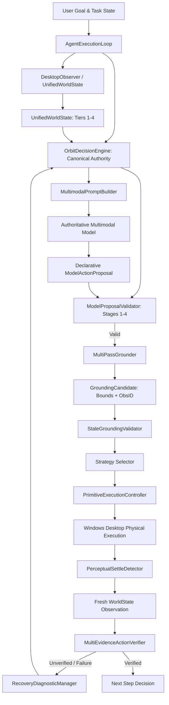

# PHASE 2E: FORENSIC BASELINE OF DECISION AUTHORITIES

**Date:** 2026-09-16  
**Scope:** Forensic Codebase Audit of Decision Authorities prior to Phase 2E Consolidation  
**Target:** Establish the exact baseline of decision engines, heuristic action selectors, and runtime call flows in ORBIT.

---

## 1. Inventory of Decision Components in `src/`

| Component | File Path | Role / Implementation | Current Authority Status |
|---|---|---|---|
| `CognitiveDecisionEngine` | [`src/orbit/runtime/cognitive/engine.py`](file:///c:/Users/Aaryan%20shukla/OneDrive/Desktop/ORBIT/src/orbit/runtime/cognitive/engine.py) | Layered decision hierarchy: Fast deterministic rules (`_decide_deterministic`) + Recovery rules + LLM escalation fallback. | **ACTIVE DEFAULT** in `agent_loop.py` (Heuristics dominate before LLM). |
| `AgentDecisionEngine` | [`src/orbit/runtime/cognitive/agent_decision.py`](file:///c:/Users/Aaryan%20shukla/OneDrive/Desktop/ORBIT/src/orbit/runtime/cognitive/agent_decision.py) | Historical decision engine tracking `AgentDecisionTrace` and legacy step resolution. | **LEGACY / PRESERVED** (Inactive in main loop, preserved for reference). |
| `_decide_deterministic` | [`src/orbit/runtime/cognitive/engine.py:248`](file:///c:/Users/Aaryan%20shukla/OneDrive/Desktop/ORBIT/src/orbit/runtime/cognitive/engine.py) | Rule-based action generator for app launch, focus, and canvas interactions. | **HEURISTIC BYPASS** of model-first decision authority. |
| `MultimodalDecisionLoop` / `ModelProposalValidator` | [`src/orbit/runtime/cognitive/primitive_validator.py`](file:///c:/Users/Aaryan%20shukla/OneDrive/Desktop/ORBIT/src/orbit/runtime/cognitive/primitive_validator.py) | Phase 2C deterministic 4-stage validation gate for declarative `ModelActionProposal`. | **CANONICAL VALIDATOR GATE** (To be consumed by `OrbitDecisionEngine`). |
| `MultiPassGrounder` | [`src/orbit/runtime/targeting/grounding.py`](file:///c:/Users/Aaryan%20shukla/OneDrive/Desktop/ORBIT/src/orbit/runtime/targeting/grounding.py) | Phase 2D 4-pass grounding engine (UIA $\to$ OCR $\to$ Icon $\to$ VLM). | **CANONICAL GROUNDING ENGINE**. |
| `EvidenceBasedTargetLocator` | [`src/orbit/runtime/targeting/locator.py`](file:///c:/Users/Aaryan%20shukla/OneDrive/Desktop/ORBIT/src/orbit/runtime/targeting/locator.py) | Runtime target resolution coordinator. | **TARGET RESOLUTION DISPATCHER**. |
| `PrimitiveExecutionController` | [`src/orbit/runtime/cognitive/primitive_execution_controller.py`](file:///c:/Users/Aaryan%20shukla/OneDrive/Desktop/ORBIT/src/orbit/runtime/cognitive/primitive_execution_controller.py) | Single authoritative physical dispatch & strategy selector. | **CANONICAL EXECUTION AUTHORITY**. |

---

## 2. Current Architecture Call Graph (Baseline)

```mermaid
graph TD
    UserGoal[User Goal / Prompt] --> AgentLoop[AgentExecutionLoop]
    AgentLoop --> IntentInterp[LLMIntentInterpreter]
    IntentInterp --> StructuredObj[StructuredObjective]
    AgentLoop --> Observer[CurrentStateObserver / UnifiedWorldState]
    Observer --> Obs[CurrentStateObservation]
    
    AgentLoop --> CogEngine[CognitiveDecisionEngine]
    CogEngine --> DetCheck{_decide_deterministic()}
    
    DetCheck -- "Heuristic Match" --> RuleAction[Deterministic CognitiveDecision]
    DetCheck -- "Ambiguous / Failure" --> LLMEscalation[LLM Escalation Call]
    LLMEscalation --> ModelAction[Model CognitiveDecision]
    
    RuleAction --> PrimComp[PrimitiveComposer]
    ModelAction --> PrimComp
    
    PrimComp --> PrimVal[PrimitiveValidator]
    PrimVal --> TargetLoc[EvidenceBasedTargetLocator]
    TargetLoc --> Grounding[Target Grounding]
    Grounding --> PrimExec[PrimitiveExecutionController]
    
    PrimExec --> OS[Windows Desktop / Adapters]
    OS --> FreshObs[Fresh Observation]
    FreshObs --> ActionVerifier[MultiEvidenceActionVerifier]
    ActionVerifier --> GoalVerifier[GoalVerifier]
```

### Current Architectural Problem Identified:
`CognitiveDecisionEngine._decide_deterministic()` intercepts the goal before the model is queried. The model is treated as an escalation fallback rather than the primary author of the action proposal.

---

## 3. Target Consolidated Architecture (Phase 2E)

In Phase 2E, `OrbitDecisionEngine` becomes the **SINGLE AUTHORITATIVE** decision path:



---

## 4. Invariants for Phase 2E Consolidation

1. **Model Authority Invariant**:
   The multimodal model decides **WHAT** to do. If the model is unavailable or unconfigured, the engine fails closed with structured `MODEL_UNAVAILABLE` diagnostics. No heuristic engine may silently substitute the decision.
2. **Deterministic Gate Invariant**:
   Deterministic components (`ModelProposalValidator`, `StaleGroundingValidator`, `MultiPassGrounder`, `PrimitiveExecutionController`) decide **VALIDITY, GROUNDING, and HOW** (physical mechanism). They never alter the intent or invent parameters.
3. **Freshness Invariant**:
   A candidate grounded against Observation $N$ must never be executed against Observation $N+1$ without re-grounding.
4. **Preservation Invariant**:
   `CognitiveDecisionEngine` and `agent_decision.py` are decoupled and kept in repo without deletion until full regression and E2E gates pass.
