# Phase 2G: 50-Task General Reliability Benchmark Specification

## 1. Executive Summary & Objective

The **Phase 2G Benchmark Suite** provides the canonical baseline evaluation harness for the ORBIT AI-Native Desktop Agent. It assesses general OS automation reliability across **50 realistic tasks** partitioned into two disjoint sets:
- **25 Development Tasks (`benchmark/development/`)**: Used for system tuning, iterative testing, and component calibration.
- **25 Unseen Tasks (`benchmark/unseen/`)**: Genuinely unseen, frozen evaluation tasks used to prevent per-task prompt overfitting and measure true generalization.

All tasks execute against the **real live Windows desktop environment** via native Win32/UIA/DirectX/OCR subsystems and undergo **independent multi-tier postcondition verification** without relying on self-reported model claims.

---

## 2. Invariant Operating Rule

Throughout benchmark definition, execution, and metric computation, the core ORBIT architectural invariant is maintained:

$$\text{Model} = \text{WHAT} \quad\longrightarrow\quad \text{Grounding} = \text{WHERE} \quad\longrightarrow\quad \text{Strategy} = \text{HOW} \quad\longrightarrow\quad \text{Executor} = \text{DO} \quad\longrightarrow\quad \text{Verifier} = \text{DID IT HAPPEN}$$

1. **Model**: Pure semantic reasoning over abstract intents and semantic targets. Never outputs raw $(x, y)$ pixels.
2. **Grounding**: Multimodal fusion across Win32 HWND hierarchy, UIA tree, OCR tokens, and VLM evidence.
3. **Strategy**: Selection of execution modality (UIA invoke, native Win32 message, hardware input event).
4. **Executor**: Physical execution via native Win32 `SendInput` or Win32 message queues.
5. **Independent Verifier**: Objective ground-truth inspection of window focus, PID state, filesystem magic bytes, and SHA256 hashes.

---

## 3. Benchmark Task Distribution & Categories

The 50 tasks span 10 desktop interaction categories:

| Category | Dev Split Count | Unseen Split Count | Total Tasks | Description |
| :--- | :---: | :---: | :---: | :--- |
| **APPLICATION_LAUNCH** | 4 | 4 | 8 | Launching OS utilities, text editors, calculators, browsers |
| **FILE_CREATION** | 3 | 3 | 6 | Creating structured documents, source code, text files |
| **TEXT_EDITING** | 3 | 3 | 6 | Inserting, modifying, appending, and formatting document content |
| **FILE_MANAGEMENT** | 3 | 3 | 6 | Copying, renaming, organizing, archiving filesystem entries |
| **DATA_EXTRACTION** | 2 | 2 | 4 | Scraping on-screen tabular data, system info, directory stats |
| **WINDOW_MANAGEMENT** | 3 | 3 | 6 | Tiling, snapping, minimizing, restoring, switching active windows |
| **WEB_NAVIGATION** | 2 | 2 | 4 | URL navigation, query search, downloading web assets |
| **SYSTEM_SETTINGS** | 2 | 2 | 4 | Querying/adjusting display, date/time, task manager, network state |
| **MULTI_APP_WORKFLOW** | 2 | 2 | 4 | Cross-application pipelines (e.g., Calc $\to$ Notepad $\to$ Explorer) |
| **ERROR_RECOVERY** | 1 | 1 | 2 | Handling missing files, save-as collision dialogs, invalid paths |
| **TOTAL** | **25** | **25** | **50** | Full Evaluation Suite |

---

## 4. Multi-Tier Verification Schema

Task outcomes are verified through a multi-tier pipeline:

### 4.1 Window & OS Process State
- Query active foreground window HWND and caption (`GetForegroundWindow`).
- Enumerate visible top-level windows (`EnumWindows`).
- Verify expected executable process IDs (`notepad.exe`, `calc.exe`, `explorer.exe`).
- Confirm closed processes when termination is required.

### 4.2 Physical Filesystem & Artifact Deliverables
- Target path existence verification in candidate scratchpads/desktop.
- Minimum file size verification ($> 0$ bytes or minimum threshold).
- Magic byte file signature verification (PNG `\x89PNG`, JPEG `\xff\xd8\xff`, PDF `%PDF-`, ZIP `PK\x03\x04`, BMP `BM`).
- Text content substring matching (`expected_content_substr`).
- Exact SHA256 cryptographic checksum matching (`expected_checksum_sha256`).

---

## 5. 15-Class Failure Taxonomy

When a task fails or aborts, the benchmark engine classifies the root failure mode into one of 15 categories:

```mermaid
graph TD
    Failure[Task Failure] --> Intent[1. Intent & Planning Failures]
    Failure --> Perception[2. Perception & Grounding Failures]
    Failure --> Execution[3. Execution & Action Failures]
    Failure --> Verification[4. Verification & State Failures]
    Failure --> Context[5. Context & Environment Failures]

    Intent --> F1[INTENT_ERROR: Misunderstood Goal]
    Intent --> F2[GOAL_DECOMPOSITION_FAILURE: Flawed Subgoals]
    Intent --> F3[PLANNING_STALL: Infinite Loop / No Progress]

    Perception --> F4[PERCEPTION_MISS: Visual/OCR Element Not Seen]
    Perception --> F5[GROUNDING_COORDINATE_ERROR: Clicked Wrong Target]
    Perception --> F6[VLM_HALLUCINATION: Targeted Phantom Element]

    Execution --> F7[ACTION_DISPATCH_TIMEOUT: Action Timed Out]
    Execution --> F8[INPUT_REJECTION: OS Rejected Keystroke/Click]
    Execution --> F9[APP_CRASH_OR_FREEZE: Target Window Hung]

    Verification --> F10[FALSE_POSITIVE_SUCCESS: Self-Reported Without Proof]
    Verification --> F11[STATE_DELTA_MISMATCH: Post-State Did Not Change]
    Verification --> F12[ARTIFACT_VERIFICATION_FAILED: File Missing or Bad Magic]

    Context --> F13[CONTEXT_DRIFT: Lost Focus After 10+ Steps]
    Context --> F14[RECOVERY_FAILURE: Trapped in Error/Save Dialog]
    Context --> F15[TIMEOUT_BUDGET_EXCEEDED: Exceeded Step/Time Cap]
```



---

## 6. Execution Harness Architecture

The benchmark subsystem is structured into clean, modular components:

```
benchmark/
├── schema.py           # Pydantic v2 data models for tasks, deliverables, traces, metrics
├── taxonomy.py         # 15-class failure taxonomy and automated classification engine
├── verifier.py         # Independent OS window state and filesystem byte verifier
├── environment.py      # Pre/post task process isolation and scratchpad directory reset
├── runner.py           # Benchmark runner CLI, execution engine, and Markdown reporter
├── development/        # 25 Development task manifests (task_001.json - task_025.json)
├── unseen/             # 25 Frozen unseen task manifests (task_026.json - task_050.json)
└── results/            # Run outputs: per-task execution logs, summary JSON, report MD
```
