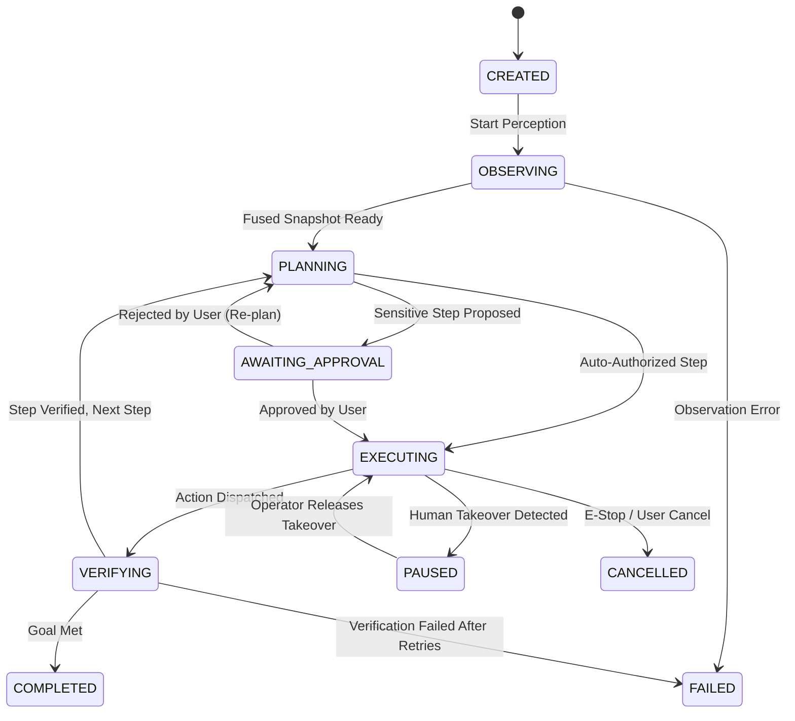

# ORBIT Core Runtime State Machine & Execution Lifecycle Specification
**Document Version:** 1.0.0  
**Status:** APPROVED RUNTIME STATE MACHINE  

---

## 1. Unified Hierarchical State Architecture

The ORBIT Runtime coordinates three concurrent, hierarchical state machines:
1. **System Lifecycle State Machine**: High-level lifecycle of the ORBIT process.
2. **Task Orchestration State Machine**: Lifecycle of user-submitted goals and multi-step plans.
3. **Action Execution State Machine**: Low-level microsecond lifecycle of individual pointer and keyboard dispatches.

```text
┌────────────────────────────────────────────────────────────────────────┐
│                   SYSTEM LIFECYCLE (Level 1)                           │
│   UNINITIALIZED ──► IDLE_READY ◄──► TASK_ACTIVE ──► SHUTTING_DOWN      │
│                           │               ▲                            │
│                           ▼               │                            │
│                  UNRESOLVED_LOCKED (Fail-Closed)                       │
└───────────────────────────┬────────────────────────────────────────────┘
                            │
┌───────────────────────────▼────────────────────────────────────────────┐
│                   TASK ORCHESTRATION (Level 2)                         │
│   CREATED ──► OBSERVING ──► PLANNING ──► AWAITING_APPROVAL ──►         │
│                     │           │                                      │
│                     ▼           ▼                                      │
│                  EXECUTING ──► VERIFYING ──► COMPLETED / FAILED        │
│                     │                                                  │
│                     ▼                                                  │
│                  PAUSED (Human Takeover) / CANCELLED                   │
└───────────────────────────┬────────────────────────────────────────────┘
                            │
┌───────────────────────────▼────────────────────────────────────────────┐
│                   ACTION EXECUTION (Level 3)                           │
│   REQUESTED ──► TARGET_VALIDATING ──► PRE_DISPATCH_CHECK ──►           │
│                                              │                         │
│                                              ▼                         │
│                   DISPATCHING (SendInput) ──► OBSERVED ──► VERIFIED    │
└────────────────────────────────────────────────────────────────────────┘
```

---

## 2. Level 1: System Lifecycle State Machine

| State | Description | Permitted Next States |
| :--- | :--- | :--- |
| `UNINITIALIZED` | Process starting; loading configuration and validating Win32 environment. | `IDLE_READY`, `SHUTTING_DOWN` |
| `IDLE_READY` | Ready to accept new tasks or client connections; hooks active. | `TASK_ACTIVE`, `SHUTTING_DOWN`, `UNRESOLVED_LOCKED` |
| `TASK_ACTIVE` | Actively executing an agent perception-planning-action loop. | `IDLE_READY`, `TAKEOVER_ACTIVE`, `UNRESOLVED_LOCKED` |
| `TAKEOVER_ACTIVE` | Human operator has seized input control; AI actions halted. | `TASK_ACTIVE` (resumed), `IDLE_READY` (cancelled) |
| `UNRESOLVED_LOCKED`| Fail-closed hard lockout triggered by sanitization failure. | `IDLE_READY` (via explicit operator recovery only) |
| `SHUTTING_DOWN` | Performing graceful shutdown, restoring AppBar work area, unhooking. | `TERMINATED` |

### Hard Lockout Invariant
* While in `UNRESOLVED_LOCKED`, the state machine unconditionally rejects all `SUBMIT_TASK` and action execution requests.
* Recovery requires calling `recover_manual_lockout("CONFIRM_OPERATOR_MANUAL_RESET")`.
* Timers, cancellations, or UI reconnections cannot bypass the lockout.

---

## 3. Level 2: Task Orchestration State Machine



### State Definitions

1. **`CREATED`**: Task parsed, session assigned, and task context initialized.
2. **`OBSERVING`**: Triggering multi-source capture (GDI/UIA/MSAA/OCR) through `ObservationCapability`.
3. **`PLANNING`**: Model router analyzing visual snapshot and generating structured step or tool call.
4. **`AWAITING_APPROVAL`**: High-risk action (e.g. destructive shortcut or system modification) waiting for user confirmation in UI.
5. **`EXECUTING`**: Active dispatch of validated mouse movement, click, or keystrokes.
6. **`VERIFYING`**: Post-action accessibility and visual delta readback to confirm target effect.
7. **`PAUSED`**: Human takeover active; worker threads suspended and waiting.
8. **`COMPLETED`**: Goal achieved with verified observation evidence.
9. **`CANCELLED`**: Cancelled via cooperative cancellation token; all held inputs sanitized.
10. **`FAILED`**: Unrecoverable execution error or step retry limit exceeded.

---

## 4. Level 3: Action Execution State Machine

Every individual pointer or keyboard interaction executes a deterministic 7-phase validation pipeline:

```text
Phase 1: Target Validation (TargetValidator 9-gate check: HWND, PID, Bounds, TTL, Foreground)
   │
   ▼ (Valid)
Phase 2: Pre-Dispatch Topology Check (Verify display resolution / origin matches snapshot)
   │
   ▼ (Matched)
Phase 3: Cooperative Cancellation Check 1 (Verify CancellationToken is not cancelled)
   │
   ▼ (Not Cancelled)
Phase 4: ABI Verification Check (Verify AbiGate.is_injection_enabled())
   │
   ▼ (Valid)
Phase 5: Single Gateway SendInput Dispatch (NativeDispatchGateway.dispatch_single_packet)
   │
   ▼ (Packet Accepted M >= 1)
Phase 6: Cooperative Cancellation Check 2 & Readback (GetCursorPos / Keystroke echo)
   │
   ▼ (Readback within tolerance)
Phase 7: Action Verified (ActionCompleted event emitted to EventBus)
```

---

## 5. Preemption & Cancellation Dynamics

When a cancellation signal arrives (via UI E-Stop, WebSocket disconnect, or Human Takeover Hook):

1. **Microsecond Hook Interception ($t < 50\,\mu\text{s}$)**: Low-level hook detects physical mouse displacement exceeding trajectory corridor $\rightarrow$ sets atomic `CancellationToken.cancel()`.
2. **Immediate Pre-Dispatch Abort ($t < 100\,\mu\text{s}$)**: Any pending action awaiting SendInput immediately returns `CANCELLED_BEFORE_DISPATCH` with 0 packets injected.
3. **In-Flight Hold Sanitization ($t < 2\,\text{ms}$)**: If cancellation occurs while a mouse button or key is synthetically held down, `emergency_sanitize()` immediately emits release packets.
4. **Worker Thread Suspension ($t < 5\,\text{ms}$)**: Background planning and observation worker threads check cancellation tokens at loop headers and safely terminate.
